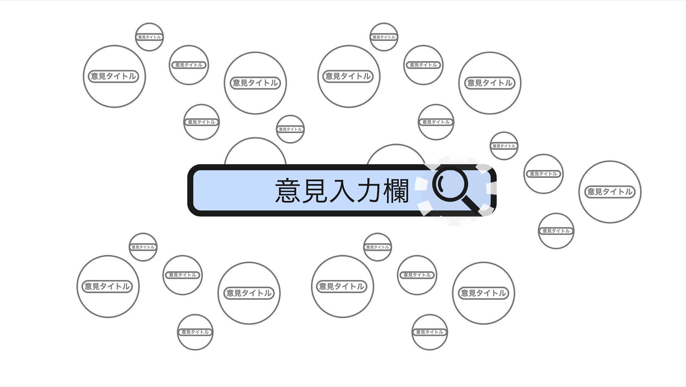
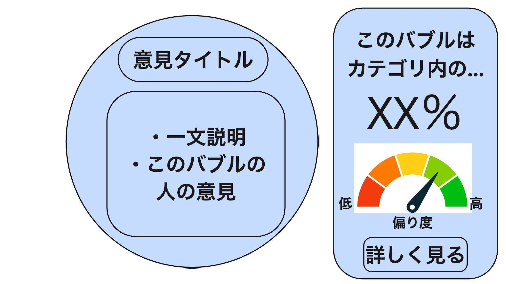
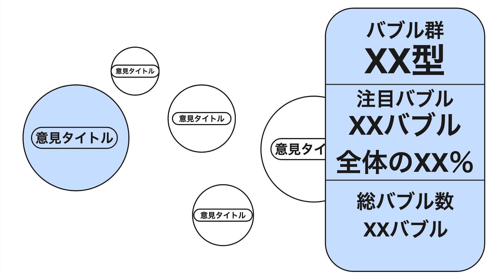
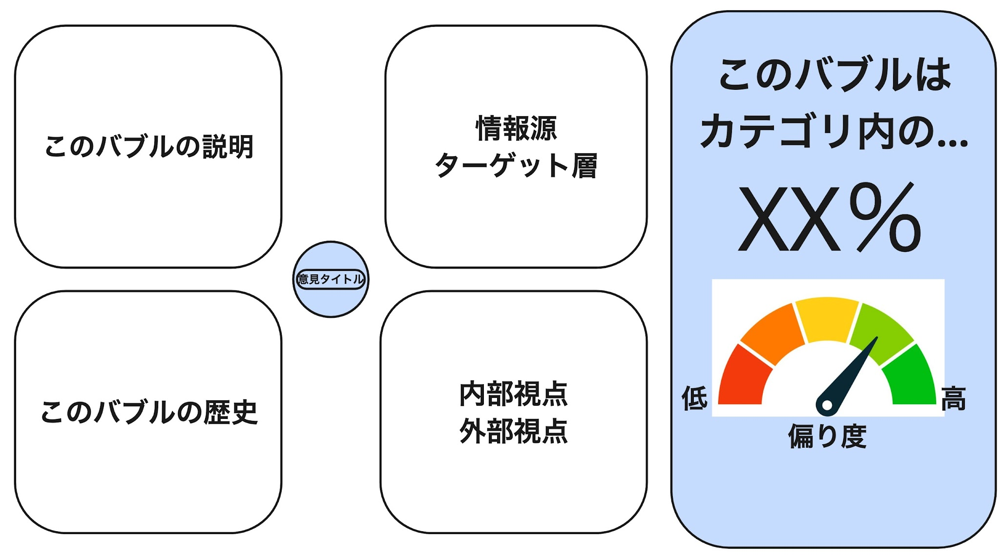
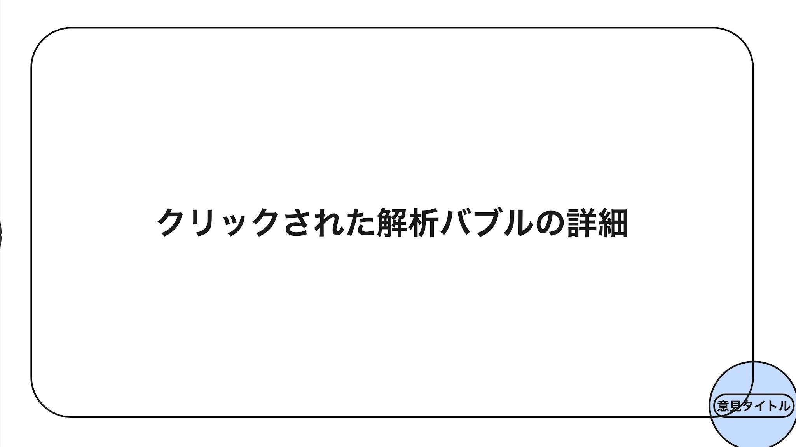

# BubbleBreaker 仕様書

> 原本: `BubbleBreaker仕様書.xlsx`

## 1. サービス説明

| 項目 | 説明 |
| --- | --- |
| タイトル | BubbleBreaker - 君の世界は、編集されている - |
| 概要 | 検索エンジンやSNSの最適化により、私たちは似た意見に囲まれる「フィルターバブル」に陥っています。本プロジェクトでは、インターネット上の意見を距離や影響度を持つバブル地図として可視化し、階層的にズーム可能な構造で探索できるツールを開発します。自分の立ち位置や偏りを俯瞰し、多様な視点を横断的に発見できる環境を実現します。 |
| 解決したい課題 | ネットに大きく依存している現代では、検索や閲覧、いいね、広告などの履歴からユーザーが欲する情報が優先表示され、情報の偏りや意見の極端化が起こる「フィルターバブル」にほとんどの人が陥っています。また、似た意見を持つ人とのつながりによって同じ意見が増幅し、異なる意見を過剰に攻撃・反対してしまう「エコーチェンバー」現象も起きています。 |
| 解決方針 | 自分の意見の立ち位置や偏りを俯瞰し、多様な視点を横断的に発見できるツールを作ります。 |
| このツールでユーザーに起きること | フィルターバブルやエコーチェンバーを自覚し、様々な情報への気づきを得て、世の中の自分になかった視点に気づくことができます。 |
| 画面コンセプト | 無数の銀河群のようなバブル群の宇宙。インターネット上の無数の情報、派閥、意見などへアクセスできるワクワク感と、ズームインしてフィルターバブルに陥る感覚、ズームアウトして俯瞰的に情報を見る感覚を表現します。 |
| 画面の一貫した表現方法 | ズームイン・ズームアウトしても階層の異なるバブル群が表示される、フラクタル構造的な面白さを表現します。 |

## 2. バブル群の型

### 分散型

- 特徴: 意見が複数に分かれ、ほぼ均等に存在している。
- 例: 「好きな色」「おすすめアニメ」
- 意味: 明確な正解がなく、好みが広く分散している。

### 一極集中型

- 特徴: 1つの大きなバブルが大半を占める。
- 例: 「ポケモンは有名か？」
- 意味: 大多数が同意し、反対意見が少ない。

### 多極型

- 特徴: 大きなバブル2〜4個が多くを占め、互いの距離が遠い。
- 例: 「きのこ派 vs たけのこ派」
- 意味: 意見がはっきり対立している。

## 3. 意見入力画面

### 目的

ツール起動時に表示し、ユーザーが自分の意見を入力します。

### 画面サンプル

### 画面構成

- 背景: 無数の銀河群のようなバブル群が連なる宇宙。情報・派閥・意見へアクセスできるワクワク感と、ズームイン／ズームアウトによるフィルターバブルの感覚を表現します。
- 意見入力欄: 画面中央にテキストボックスを配置します。

### 画面遷移

意見を入力して確定すると入力欄が消え、背景のバブル宇宙を調査する読み込み状態へ遷移します。読み込み中は、ロケットの持ち手が付いた虫眼鏡が背景のバブル群上を飛び回り、読み込み完了後に対象へズームします。

遷移先は「バブルフラクタル地図ズーム状態画面」です。

## 4. 個別バブル画面

### 目的

入力された意見が含まれるバブル、またはバブル群画面からズーム・クリックされたバブルの簡易説明を表示します。

### 画面サンプル

### 画面構成

- 背景: 無数の銀河群のようなバブル群の宇宙。
- 左側: 対象バブルを大きく表示し、上部に意見タイトル、下部に簡易説明を表示します。
- 右側: 同じカテゴリ内で対象バブルが占める割合、偏り度メーター、詳しく見るボタンを表示します。

### 画面遷移

| 操作 | 動作 | 遷移先 |
| --- | --- | --- |
| ズームアウト | 対象バブルを含む同じカテゴリのバブル群を俯瞰表示する | バブル群画面 |
| ズームイン | 対象バブルに含まれる一つ下のカテゴリを俯瞰表示する | バブル群画面 |
| バブルクリック／詳しく見る | 対象バブルの4種類の解析結果を表示する | 個別バブル解析画面 |

## 5. バブル群画面

### 目的

- 個別バブル画面からズームインした場合: 見ていたバブルに含まれる一つ下のバブル群を俯瞰表示します。
- 個別バブル画面からズームアウトした場合: 見ていたバブルを含む同じカテゴリのバブル群を俯瞰表示します。
- カテゴリ全体の構成を把握できるようにします。

### 画面サンプル

### 画面構成

- 背景: 無数の銀河群のようなバブル群の宇宙。
- 3D空間: この階層のバブルを最大10個程度、意見や派閥の近さに応じた距離で配置します。各バブルの大きさはネット上での話題度に比例させます。
- 右側（仮）: バブル群の型、最大のバブルのタイトルと占有割合などを表示し、この階層の全体像を示します。

### 画面遷移

特定のバブル周辺へのズーム、またはバブルクリックで、カーソルに最も近いバブル／クリックされたバブルの個別バブル画面へ遷移します。

## 6. 個別バブル解析画面

### 目的

個別バブル画面またはバブル群画面から選択されたバブルの解析結果を表示します。

### 画面サンプル

### 画面構成

- 中央: 意見タイトルだけを表示した、画面縦の約1/5サイズのバブル。
- 左上の解析バブル: バブルの説明、関連写真、グラフ。
- 左下の解析バブル: バブルが生まれた時期と形成の歴史、グラフ。
- 右上の解析バブル: 情報源やターゲット層、グラフ。
- 右下の解析バブル: バブル内部の人から見た評価と、外部から見た評価・印象の文章。

### 画面遷移

| 操作 | 動作 | 遷移先 |
| --- | --- | --- |
| 解析バブルクリック | 選択した解析バブルの詳細を一画面で表示する | 解析バブル詳細表示画面 |
| 中央バブルクリック／ズームアウト | 解析バブルが中央バブルに戻る | 個別バブル画面 |

> この画面のデザインは仕様書上「検討中」です。

## 7. 解析バブル詳細表示画面

### 目的

個別バブル解析画面でクリックされた解析バブルの詳細を、画面全体で表示します。

### 画面サンプル

### 画面構成

- 画面右下隅（仮）: 意見タイトルだけを表示したバブル。
- 画面全体: 選択された解析バブルの詳細を、一枚のスライドのように表示します。

### 画面遷移

| 操作 | 動作 | 遷移先 |
| --- | --- | --- |
| ズームアウト | ズームアウトモーションで解析画面へ戻る | 個別バブル解析画面 |
| 中央バブルクリック | 解析バブルが対象バブルに戻る | 個別バブル画面 |
| 解析バブルクリック | 選択中の詳細バブルを縮小するモーションで戻る | 個別バブル解析画面 |

## 8. 技術仕様

| 項目 | 利用技術 | 選定理由 | 備考 |
| --- | --- | --- | --- |
| 開発ツール | Unity | バブルやバブル群へのズームイン・ズームアウトで3Dオブジェクトを操作しやすいため | プロトタイプ時はWebアプリを想定 |
| プログラミング言語 | Unity C# | Unityを利用するため | プロトタイプ時はWeb上で動作する言語 |
| 情報ソース | OpenAI API | 情報収集のほか、グルーピングに利用予定 |  |
| 情報ソース2 | Twitter API | ソーシャルネットワーク上の情報取得 |  |
| 情報保存先 | MySQL | ツールで利用する情報を様々なクエリで出し入れするため | ツールのメインDB |
| 情報保存先2 | NoSQL | 高速にデータを出し入れするため | 主にキャッシュ用途 |
| 動作環境 | Windows & MacBook | Unity開発時のOS | プロトタイプ時はWeb |

## 9. 現行プロトタイプとの補足

現行のWebプロトタイプでは、仕様書のOpenAI API・Twitter API構成を変更し、OpenAI Responses APIのWeb Searchのみを使用しています。検索結果から生成したバブルの割合・形成史・構成層は推定値として扱い、参照URLを解析詳細画面に表示します。

また、現行実装では次の3階層を使用します。

1. 入力意見を含むカテゴリの親バブル群
2. 入力意見のバブルを含むカテゴリ
3. 入力意見バブルの下位カテゴリ
